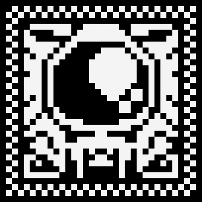

  

  

 

<h3 align="center"><b>MY TECH STACK.</b></h3>

  
  
  
  
  
  
   
  
  
  
  
  
   
  
  
  
  
   
  
  
  
  
  

 
 

  

 
 
 

<h2 align="center">🌐 Connect With Me</h2>

&nbsp;

&nbsp;

&nbsp;

&nbsp;

 
 
 

### ✍️ Random Dev Quote

<table border="0" cellspacing="0" cellpadding="0">
<tr>
<td align="center">

</td>

<td align="center">

</td>
</tr>
</table>

